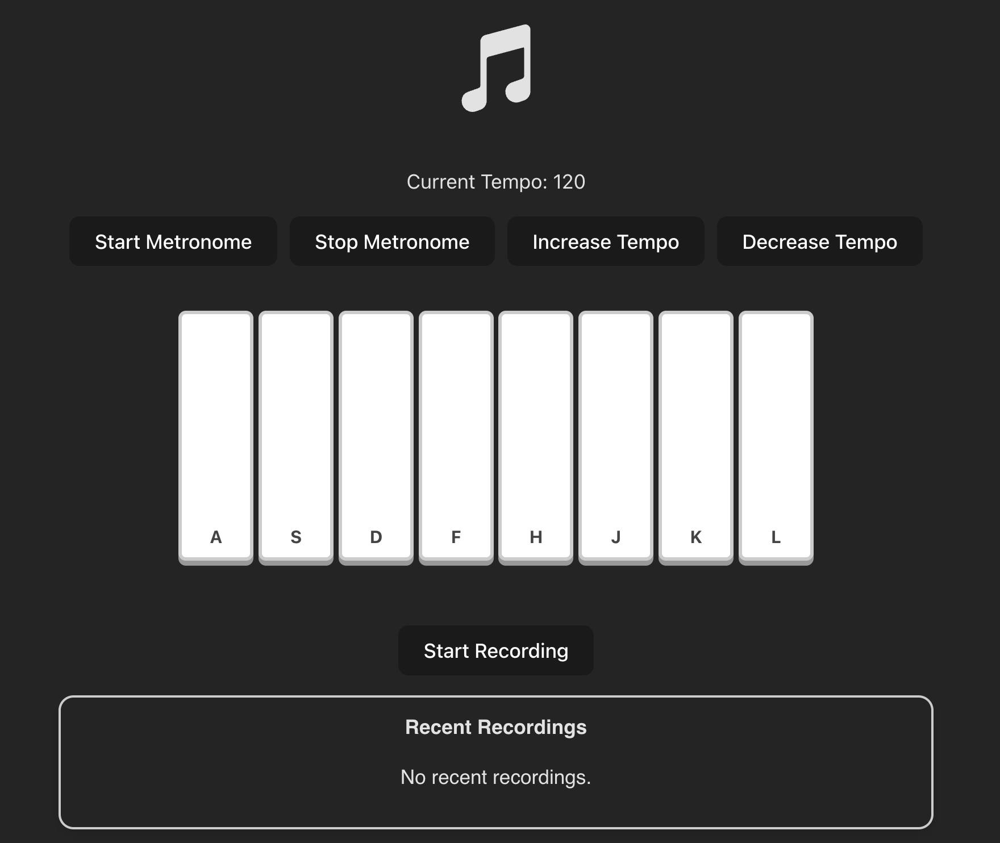

# Music Player 🎵

A simple web-based music player built with HTML, CSS, and JavaScript.  
This project allows you to play, record, and navigate through recorded history with a clean interactive UI.

---

## 🚀 Live Demo
You can try the app live here: https://Gpiero19.github.io/Music-player/

---

## 🛠 Features
- Play your own music
- Display recorded history of music  
- Responsive design  

---

## 💻 Tech Stack
- HTML5
- CSS3
- JavaScript (ES6)
- [Vite](https://vitejs.dev/) (for faster development & hot-reload)

---

## Getting Started

1. Clone the repository:

git clone https://github.com/Gpiero19/Music-player.git
cd Music-player

2. Install dependencies:

npm install

3. Run the project locally using Vite:
npx vite

4. Open your browser and go to:

http://localhost:5173

---

## What I learned / Challenge

**Working with the Web Audio API:** Learned how to load, play, and control audio files dynamically in the browser. Managing playback, track history, and responsive controls was a key challenge.

**File handling for user-selected music:** Implemented functionality for users to select their own collection of music files, which taught me how to handle file inputs securely and display metadata dynamically.

**State management in vanilla JavaScript:** Managing the player state (current track, play/pause, history) without a framework strengthened my understanding of DOM manipulation and event handling.

**Responsive design:** Ensured that the player UI works smoothly across desktop and mobile devices, which required planning layouts and testing different screen sizes.

**Integrating Vite for fast development:** Learned to set up a modern build tool with hot-reloading, speeding up development and making the project structure more maintainable.

**Problem-solving and debugging:** Handling edge cases like multiple files, simultaneous play, and updating the UI in real-time improved my debugging and troubleshooting skills.