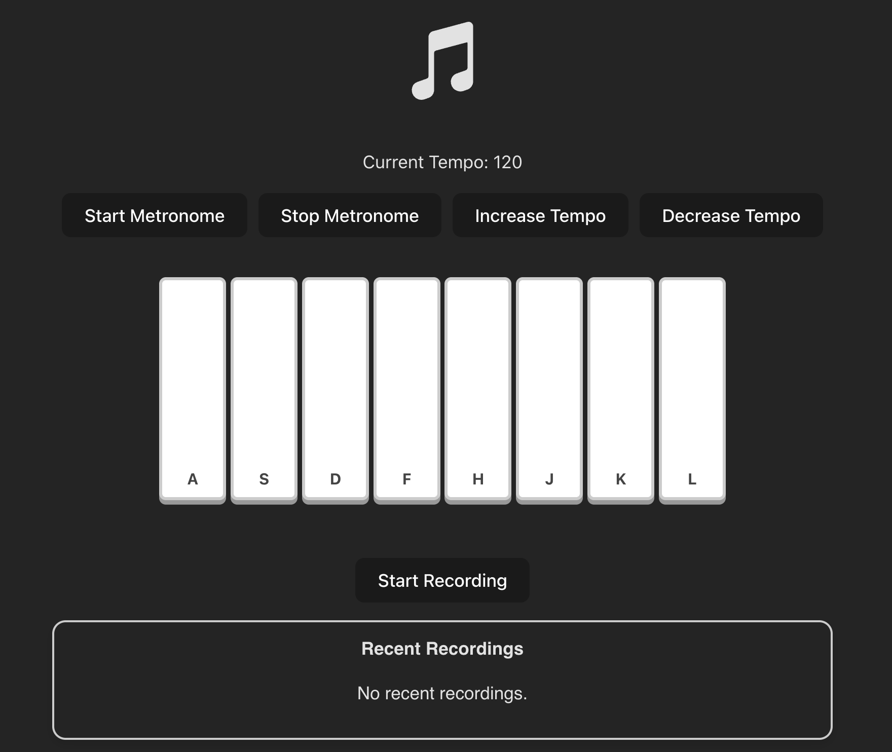

# Drum Pad

A browser-based drum pad and metronome built with React. Play eight drum sounds via keyboard or mouse, record your performance, and replay it with accurate timing.



---

## Live Demo

[https://Gpiero19.github.io/Music-player/](https://Gpiero19.github.io/Music-player/)

---

## Features

- 8 drum pad keys mapped to keyboard shortcuts (A S D F H J K L)
- Metronome with adjustable BPM (40–240), visual running indicator
- Record a performance and replay it with the original timing
- Stores up to 5 recent recordings — persisted across page refreshes via localStorage
- Responsive layout — works on desktop and mobile
- Accessible: ARIA labels on all interactive controls, respects `prefers-reduced-motion`

---

## Tech Stack

- [React 19](https://react.dev/) — functional components with custom hooks (`useAudioPool`, `useRecording`, `useRecordingHistory`, `usePlayback`, `useMetronome`)
- [TypeScript](https://www.typescriptlang.org/) — strict mode, shared types across hooks and components
- [Vite 7](https://vitejs.dev/) — build tooling and dev server
- Web Audio API — per-key pools of 3 `HTMLAudioElement` objects (round-robin) so rapid repeated hits on the same pad overlap correctly
- localStorage — lightweight persistence for recordings and session counter
- [Vitest](https://vitest.dev/) + [Testing Library](https://testing-library.com/) — unit tests for hooks and components
- [gh-pages](https://github.com/tschaub/gh-pages) — deployment to GitHub Pages

---

## Getting Started

```bash
git clone https://github.com/Gpiero19/Music-player.git
cd Music-player
npm install
npm run dev
```

Open [http://localhost:5173](http://localhost:5173) in your browser.

---

## Available Scripts

| Script | Description |
|--------|-------------|
| `npm run dev` | Start the development server |
| `npm run build` | Build for production |
| `npm run type-check` | Run TypeScript type checking |
| `npm test` | Run the test suite |
| `npm run lint` | Run ESLint |
| `npm run deploy` | Build and deploy to GitHub Pages |

---

## What I Learned

- **Custom hooks** — extracting `useAudioPool`, `useRecording`, `useRecordingHistory`, `usePlayback`, and `useMetronome` from a monolithic component to keep each hook focused on one concern and independently testable.
- **React hooks in practice** — managing audio state, recording timers, and playback with `useRef`, `useCallback`, and `useMemo` without unnecessary re-renders.
- **Audio performance** — pre-creating a pool of 3 `HTMLAudioElement` objects per pad at mount time, cycling through them round-robin so rapid repeated hits on the same pad play concurrently without audio cutting out.
- **Async playback with cancellation** — driving a timed playback loop with `setTimeout` promises and a ref-based abort flag so playback can be stopped mid-sequence.
- **localStorage persistence** — serializing and restoring structured state (recording history) across sessions with safe JSON parsing.
- **Accessibility** — adding ARIA labels to non-descriptive controls and respecting the `prefers-reduced-motion` media query for animations.
